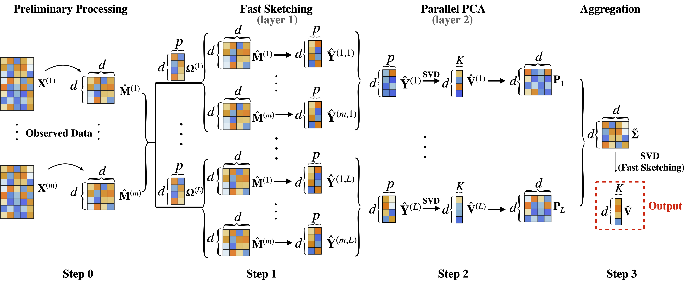

# Reproducibility Files for FADI 

## R codes
The R codes folder contains the R scripts for simulation studies, and application of FADI to the 1000 Genomes data (estimation of principal eigenspace and inferential analysis under the degree-corrected mixed membership model). 

### Simulation Studies

The following scripts implement simulation experiments under various statistical models:
- `example_spiked_covariance.R`: Spiked covariance model  
- `example_GMM.R`: Gaussian mixture model (GMM)  
- `example_DCMM.R`: Degree-corrected mixed membership model (DCMM)  
- `example_missing_matrix.R`: Incomplete matrix inference model  

Each script accepts the following input arguments:
- `d`: Dimension of the data  
- `mc`: Index for independent Monte Carlo replicates  
- `rt`: Ratio of \( Lp/d \)

These arguments should be specified when invoking the script, for example via a shell script. Below is a sample SLURM batch script:

```bash
#!/bin/bash
#SBATCH --array=1-2
#SBATCH -c 1
#SBATCH -N 1
#SBATCH -t 0-1:00
#SBATCH -p test
#SBATCH --mem=10G
#SBATCH -o %A_%a.out
#SBATCH -e %A_%a.err
#SBATCH --mail-type=NONE

module load gcc R  # Load R module
R CMD BATCH --quiet --no-restore --no-save "--args 1000 $SLURM_ARRAY_TASK_ID 1" example_GMM.R example_GMM_${SLURM_ARRAY_TASK_ID}.out
```
### 1000 Genomes Application

The following scripts apply FADI to the 1000 Genomes data to estimate the principal eigenspace across two layers:

- `1000g_estimation_layer_1.R`: Implements **Step 1** of FADI.  
  - Input arguments:  
    - `i`: Index for distributed data splits  
    - `l`: Index for parallel sketching  
    - `p`: Sketching dimension  

- `1000g_estimation_layer_2.R`: Implements **Step 2** of FADI.  
  - Input arguments:  
    - `l`: Index for parallel sketching  
    - `p`: Sketching dimension  

The following scripts further apply FADI to perform inferential analysis on the 1000 Genomes data:
- `inference_1000g_SBM.R`: Implements **Steps 1 and 2** of FADI for computing the top principal components (PCs) of an undirected graph constructed from the 1000 Genomes data.  
  - Argument:
    - `l`: Index for parallel sketching  

- `multiple_testing_1000g.Rmd`: Performs multiple testing for inferring subject populations based on the estimated PCs. This script first executes **Step 3** of FADI by aggregating sketching results to form the final FADI estimator, and then performs membership testing using the FADI PC estimators. The full inferential procedure is described in Supplement D of the paper  
  *"Dimension Reduction for Large-Scale Federated Data: Statistical Rate and Asymptotic Inference."*

### Results Collection Codes

- `table_2_spiked_cov.R`: Generates the comparison results in **Table 3**, evaluating the performance of FADI against traditional PCA and the distributed PCA method proposed by Fan et al.  
  - Input arguments:  
    - `d`: Data dimension  
    - `m`: Number of distributed data splits  
    - `mci`: Index for Monte Carlo replication  
    - `p`: Sketching dimension  

- `figures_tables.Rmd`: Aggregates simulation outputs and generates all remaining figures presented in **Section 5** and **Appendices B.1–B.2** of the paper.


## Data
The `Data` folder contains supplementary files used in the inferential analysis of the 1000 Genomes dataset:

- `1000g_sbm95.RData`: An undirected graph constructed from the 1000 Genomes data, used for the inferential application of FADI.  
- `1KG_TRACE_pca.txt`: Metadata containing population labels for the 1000 Genomes subjects.


## Workflow

